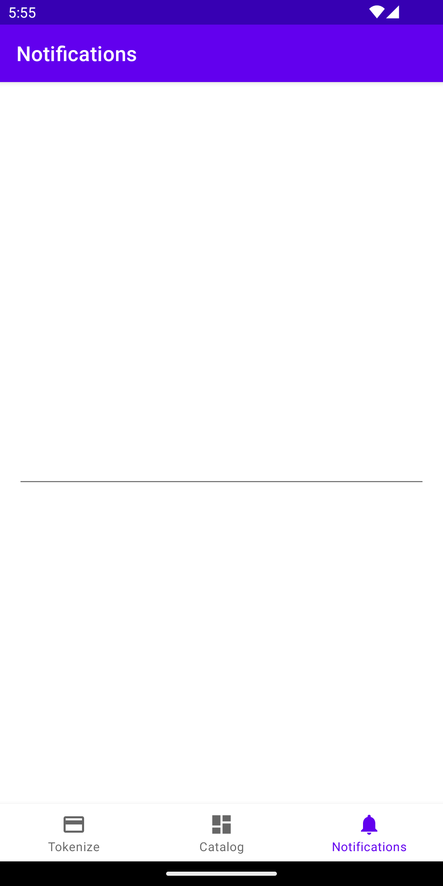

# forage-android-sdk

Forage Android SDK

Table of contents
=================

<!--ts-->
   * [Overview](#overview)
   * [Installation](#installation)
   * [UI Components](#ui-components)
     * [ForagePANEditText](#foragepanedittext)
     * [ForagePINEditText](#foragepinedittext)
     * [How to provide styles](/docs/styles.md) 
   * [Tokenizing an EBT Card](#tokenize-ebt-card-number) 
   * [Performing a balance check](#performing-a-balance-check) 
   * [Capturing a payment](#capturing-a-payment) 
   * [The ForageApiResponse sealed class](#the-forageapiresponse-sealed-class)
   * [Dependencies](#dependencies)
   * [Development](#development)
     * [Android Studio](#android-studio)
     * [How to run the unit tests](#how-to-run-the-unit-tests)
     * [How to check code coverage](#code-coverage)
     * [Code Formatting](#code-formatting)
<!--te-->

## Overview

This documentation covers the integration of Forage's Android SDK to process EBT payments.

Currently, our SDK provides APIs for

1. Tokenizing an EBT Card
2. Performing a balance check
3. Capturing a payment

which we'll cover in great detail in the following sections.

## Installation

To install the SDK, add this dependency to your module `build.gradle`

```groovy
plugins {
    id 'com.android.application'
    id 'kotlin-android'
}

android {
    ...
}

dependencies {
    ...

    // Forage Android SDK
    implementation '<package_name>:forage-android:<sem_ver>'

    ...
}
```

## UI Components 

### ForagePANEditText
```xml
<?xml version="1.0" encoding="utf-8"?>
<androidx.constraintlayout.widget.ConstraintLayout xmlns:android="http://schemas.android.com/apk/res/android"
    xmlns:app="http://schemas.android.com/apk/res-auto"
    android:layout_width="match_parent"
    android:layout_height="match_parent">

    <com.joinforage.forage.android.ui.ForagePANEditText
        android:id="@+id/foragePanEditText"
        android:layout_width="0dp"
        android:layout_height="wrap_content"
        android:layout_margin="16dp"
        app:layout_constraintBottom_toBottomOf="parent"
        app:layout_constraintEnd_toEndOf="parent"
        app:layout_constraintStart_toStartOf="parent"
        app:layout_constraintTop_toTopOf="parent" />

</androidx.constraintlayout.widget.ConstraintLayout>
```

### ForagePINEditText
```xml
<?xml version="1.0" encoding="utf-8"?>
<androidx.constraintlayout.widget.ConstraintLayout xmlns:android="http://schemas.android.com/apk/res/android"
    xmlns:app="http://schemas.android.com/apk/res-auto"
    android:layout_width="match_parent"
    android:layout_height="match_parent">

    <com.joinforage.forage.android.ui.ForagePINEditText
        android:id="@+id/foragePinEditText"
        android:layout_width="0dp"
        android:layout_height="wrap_content"
        android:layout_margin="16dp"
        app:layout_constraintBottom_toBottomOf="parent"
        app:layout_constraintEnd_toEndOf="parent"
        app:layout_constraintStart_toStartOf="parent"
        app:layout_constraintTop_toTopOf="parent" />

</androidx.constraintlayout.widget.ConstraintLayout>
```

# Usage

## Tokenizing an EBT Card

First you need to add `ForagePanEditText` to your layout file:

```xml
<androidx.constraintlayout.widget.ConstraintLayout xmlns:android="http://schemas.android.com/apk/res/android"
    xmlns:app="http://schemas.android.com/apk/res-auto"
    android:layout_width="match_parent"
    android:layout_height="match_parent">

    <com.joinforage.forage.android.ui.ForagePANEditText
        android:id="@+id/tokenizeForagePanEditText"
        android:layout_width="0dp"
        android:layout_height="wrap_content"
        android:padding="16dp"
        app:layout_constraintBottom_toBottomOf="parent"
        app:layout_constraintEnd_toEndOf="parent"
        app:layout_constraintStart_toStartOf="parent"
        app:layout_constraintTop_toTopOf="parent" />

</androidx.constraintlayout.widget.ConstraintLayout>

```

Since ForagePANEditText is currently not receiving any style from your theme, it should look like
this:



## Customizing ForagePANEditText

To provide a style to your `ForagePANEditText` you need to include these two themes attributes on
your
`attrs.xml` file:

```xml
<resources>
    ...
    <!-- Theme attribute for the ForagePANEditText on the tokenize fragment. -->
    <attr name="tokenizeForagePANEditTextStyle" format="reference" />
    <attr name="tokenizeForageTextInputLayoutStyle" format="reference" />
    ...
</resources>
```

and now you can add it to your `ForagePANEditText`:

```xml
<androidx.constraintlayout.widget.ConstraintLayout xmlns:android="http://schemas.android.com/apk/res/android"
    xmlns:app="http://schemas.android.com/apk/res-auto"
    android:layout_width="match_parent"
    android:layout_height="match_parent">

    <com.joinforage.forage.android.ui.ForagePANEditText
        android:id="@+id/tokenizeForagePanEditText"
        style="?tokenizeForagePANEditTextStyle"
        android:layout_width="0dp"
        android:layout_height="wrap_content"
        android:padding="16dp"
        app:layout_constraintBottom_toBottomOf="parent"
        app:layout_constraintEnd_toEndOf="parent"
        app:layout_constraintStart_toStartOf="parent"
        app:layout_constraintTop_toTopOf="parent" />

</androidx.constraintlayout.widget.ConstraintLayout>

```

Here is the relevant part from the application theme that shows the styles that are assigned to the `ForagePANEditText`:

```xml
<resources>
    <!-- Base application theme. -->
    <style name="Theme.Forageandroid" parent="Theme.MaterialComponents.DayNight.DarkActionBar">
        ...
        <!-- The ForagePanEditText shown in tokenize Fragment -->
        <item name="tokenizeForagePANEditTextStyle">@style/TokenizeForagePANEditTextStyle</item>
        <item name="tokenizeForageTextInputLayoutStyle">@style/TokenizeForageTextInputLayoutStyle</item>
        ...
    </style>
</resources>
```

And finally, here are the assigned styles:

```xml
<?xml version="1.0" encoding="utf-8"?>
<resources>
    ...
    <style name="DefaultForagePANEditTextStyle">
        <!-- Default properties can be added here that will be applied to every ForagePANEditText. -->
    </style>

    <!-- Style for the ForagePANEditText -->
    <style name="TokenizeForagePANEditTextStyle" parent="DefaultForagePANEditTextStyle">
        <item name="textInputLayoutStyle">@attr/tokenizeForageTextInputLayoutStyle</item>
    </style>

    <style name="TokenizeForageTextInputLayoutStyle" parent="Widget.MaterialComponents.TextInputLayout.OutlinedBox">
        <item name="android:hint">@string/tokenize_forage_edit_text_hint</item>
        <item name="boxStrokeWidth">1dp</item>
    </style>
    ...
</resources>
```


## Tokenize EBT card number
ForageSDK will expose the following function to collect the EBT card number:

```kotlin
    suspend fun tokenizeEBTCard(
        merchantAccount: String,
        bearerToken: String
    ): ForageApiResponse<String>
```

This is an example of usage inside an ACC ViewModel:

```kotlin
    fun onSubmit() = viewModelScope.launch {
        _isLoading.value = true
    
        val response = ForageSDK.tokenizeEBTCard(
            merchantAccount = merchantAccount,
            bearerToken = bearer
        )
    
        when (response) {
            is ForageApiResponse.Success -> {
                val adapter: JsonAdapter<PaymentMethod> = moshi.adapter(PaymentMethod::class.java)
    
                val result = adapter.fromJson(response.data)
    
                _paymentMethod.value = result
            }
            is ForageApiResponse.Failure -> {
                _error.value = response.message
            }
        }
    
        _isLoading.value = false
    }
```

## Performing a balance check
ForageSDK will expose the following function to check the EBT card balance:

```kotlin
    suspend fun checkBalance(
        context: Context,
        pinForageEditText: ForagePINEditText,
        merchantAccount: String,
        bearerToken: String,
        paymentMethodRef: String,
        cardToken: String
    ): ForageApiResponse<String>
```

To help maintain the sensitive information PCI compliant, this function needs the `ForagePINEditText` reference and the Context so we can cancel ongoing requests properly.

This is an example of usage inside an ACC ViewModel:

```kotlin
    fun checkBalance(context: Context, pinForageEditText: ForagePINEditText) =
    viewModelScope.launch {
        _isLoading.value = true

        val response = ForageSDK.checkBalance(
            context = context,
            pinForageEditText = pinForageEditText,
            merchantAccount = merchantAccount,
            bearerToken = bearer,
            paymentMethodRef = paymentMethodRef,
            cardToken = cardToken
        )

        when (response) {
            is ForageApiResponse.Success -> {
                println(response.data)

                val adapter: JsonAdapter<BalanceResponse> =
                    moshi.adapter(BalanceResponse::class.java)

                val result = adapter.fromJson(response.data)

                if (result != null) {
                    _snap.value = "SNAP: ${result.snap}"
                    _nonSnap.value = "NON SNAP: ${result.nonSnap}"
                    _isLoading.value = false
                    _isNextVisible.value = true
                }
            }
            is ForageApiResponse.Failure -> {
                _isLoading.value = false
                _error.value = response.message
            }
        }
    }
```

## Capturing a payment
ForageSDK will expose the following function to capture a payment:

```kotlin
    suspend fun capturePayment(
        context: Context,
        pinForageEditText: ForagePINEditText,
        merchantAccount: String,
        bearerToken: String,
        paymentRef: String,
        cardToken: String
    ): ForageApiResponse<String>
```

This is an example of usage inside an ACC ViewModel:

```kotlin

    fun captureSnapAmount(context: Context, pinForageEditText: ForagePINEditText) =
        viewModelScope.launch {
            _uiState.value = _uiState.value!!.copy(isLoading = true)
    
            val response = ForageSDK.capturePayment(
                context = context,
                pinForageEditText = pinForageEditText,
                merchantAccount = merchantAccount,
                bearerToken = bearer,
                paymentRef = snapPaymentRef,
                cardToken = cardToken
            )
    
            when (response) {
                is ForageApiResponse.Success -> {
                    _uiState.value = _uiState.value!!.copy(
                        isLoading = false,
                        snapResponse = response.data
                    )
                }
                is ForageApiResponse.Failure -> {
                    _uiState.value = _uiState.value!!.copy(
                        isLoading = false,
                        snapResponse = response.message
                    )
                }
            }
        }
```

The `paymentRef` will be used to determine if it's a capture from EBT Cash or EBT SNAP. You'll need to handle a single or two payments in your implementation.
You can also make two calls two ForageSDK.capturePayment to capture both payments with a single action and then process the two responses to determine what will be shown to the user.

## The ForageApiResponse sealed class

The SDK provide suspending functions to interact with the Forage API.
`ForageApiResponse` is a sealed class that could be either a `Success` or a `Failure`

```kotlin
sealed class ForageApiResponse<out T> {
    data class Success<out T>(val data: T) : ForageApiResponse<T>()

    data class Failure(val message: String) : ForageApiResponse<Nothing>()
}

```

## Dependencies
- Minimum API Level Android 5.0 (API level 21)
- [kotlinx.coroutines](https://github.com/Kotlin/kotlinx.coroutines) v1.6.4
- 3rd party libraries:
    - [VGS-Collect-Android](https://github.com/verygoodsecurity/vgs-collect-android) v1.7.3
      - [OkHttp](https://github.com/square/okhttp) v4.10.0
  
## Development
### Android Studio
This project was developed using Android Studio Electric Eel, but you can also use Android Studio Dolphin since it's currently using Android Gradle Plugin version 7.3.1.

### How to run the unit tests
Run the test task for dev debug build variant:
```shell
./gradlew testDevDebugUnitTest  
```

Currently, our build variants are only changing env vars, so any `test<dev/staging/cert/sandbox/prod><debug/release>UnitTest` variants should run the same tests producing the same result.

### Code coverage
We use [Kover](https://github.com/Kotlin/kotlinx-kover) to extract our code coverage.
To check the SDK coverage, you can run:

```shell
 ./gradlew forage-android:koverHtmlReport  
```

Kover will provide the report link when it finishes running:

```shell
> Task :forage-android:koverHtmlReport
Kover: HTML report for ':forage-android' file:///<project_path>/forage-android/forage-android/build/reports/kover/html/index.html
```
- We are not filtering out classes/files that unit tests will not cover.

### Code formatting
This project uses [Spotless](https://github.com/diffplug/spotless) to format the code. Before pushing the code, you may need to run the following:

```shell
 ./gradlew spotlessCheck # Checks that sourcecode satisfies formatting steps 
 ./gradlew spotlessApply  # Applies code formatting steps to sourcecode in-place
```