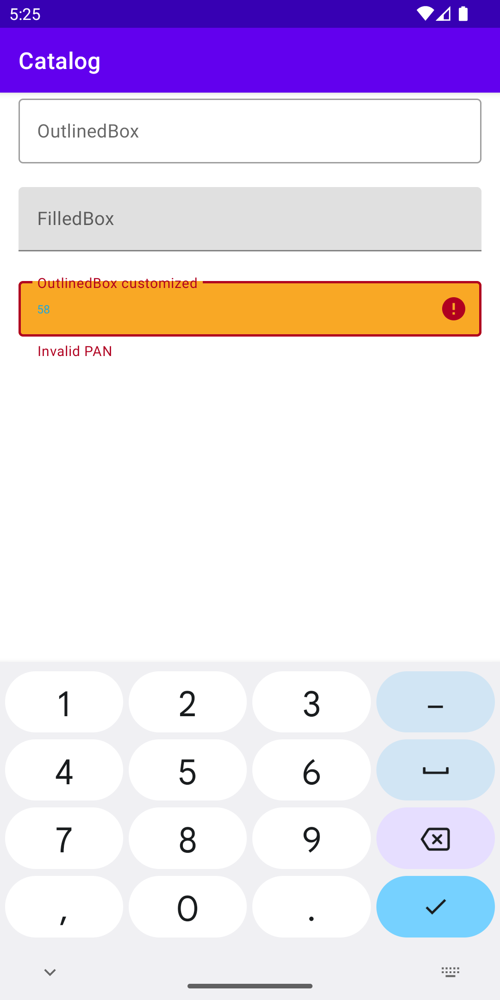

# Forage Android SDK (`v3.6.0`)

## Table of contents

<!--ts-->

- [Overview](#overview)
- [Installation](#installation)
- [UI Components](#ui-components)
  - [ForagePANEditText](#foragepanedittext)
  - [ForagePINEditText](#foragepinedittext)
  - [How to provide styles](/docs/styles.md)
- [Tokenizing an EBT Card](#tokenizing-an-ebt-card)
- [Performing a balance check](#performing-a-balance-check)
- [Capturing a payment](#capturing-a-payment)
- [Submitting the PIN for a deferred payment](#submitting-the-pin-for-a-deferred-payment)
- [The ForageApiResponse sealed class](#the-forageapiresponse-sealed-class)
- [Running the Sample App](#running-the-sample-app)
- [Dependencies](#dependencies)
<!--te-->

## Overview

This documentation explains how to integrate the Forage Android SDK to process EBT payments.

In addition to [UI components](#ui-components), the SDK provides APIs for:

1. [Tokenizing an EBT Card](#tokenizing-an-ebt-card)
2. [Performing a balance check](#performing-a-balance-check)
3. [Capturing a payment](#capturing-a-payment)
4. [Submitting the PIN for a deferred payment](#submitting-the-pin-for-a-deferred-payment)

Read on for installation instructions and details about the APIs.

## Installation

To install the SDK, add this dependency to your module `build.gradle`

```groovy
plugins {
    id 'com.android.application'
    id 'kotlin-android'
}

android {
    ...
}

dependencies {
    ...

    // Forage Android SDK
    implementation 'com.joinforage:forage-android:<sem_ver>'

    ...
}
```

## UI Components

The Android SDK exposes two text field components, collectively referred to as
`ForageElement`s since they adhere to the [`ForageElement` interface](https://github.com/teamforage/forage-android-sdk/blob/6af970d657095e80ea5ce07f98b12ba031d6e649/forage-android/src/main/java/com/joinforage/forage/android/ui/ForageElement.kt#L15)

### ForagePANEditText

A UI text field component for a customer to enter their EBT card number. It is
used to obtain a reusable or a single-use reference to a tokenized version of
the customer's EBT card number (also referred to as the Primary Account Number).

```xml
<?xml version="1.0" encoding="utf-8"?>
<androidx.constraintlayout.widget.ConstraintLayout xmlns:android="http://schemas.android.com/apk/res/android"
    xmlns:app="http://schemas.android.com/apk/res-auto"
    android:layout_width="match_parent"
    android:layout_height="match_parent">

    <com.joinforage.forage.android.ui.ForagePANEditText
            android:id="@+id/foragePanEditText"
            android:layout_width="0dp"
            android:layout_height="wrap_content"
            android:layout_margin="16dp"
            app:layout_constraintBottom_toBottomOf="parent"
            app:layout_constraintEnd_toEndOf="parent"
            app:layout_constraintStart_toStartOf="parent"
            app:layout_constraintTop_toTopOf="parent"
            android:textColor="?android:attr/textColor"
            android:textSize="?android:attr/textSize"
            app:panBoxStrokeColor="?attr/panBoxStrokeColor"
            app:panBoxStrokeWidthFocused="?attr/panBoxStrokeWidthFocused"
            app:panBoxStrokeWidth="?attr/panBoxStrokeWidth"
            app:cornerRadius="?attr/cornerRadius"
            app:textInputLayoutStyle="?attr/textInputLayoutStyle" />

</androidx.constraintlayout.widget.ConstraintLayout>
```

### ForagePINEditText

A UI component for a customer to enter their EBT card PIN. It is used to check
the associated SNAP and EBT Cash balances, or capture a payment, with
[a tokenized EBT card number](#foragepanedittext).

```xml
<?xml version="1.0" encoding="utf-8"?>
<androidx.constraintlayout.widget.ConstraintLayout xmlns:android="http://schemas.android.com/apk/res/android"
    xmlns:app="http://schemas.android.com/apk/res-auto"
    android:layout_width="match_parent"
    android:layout_height="match_parent">

    <com.joinforage.forage.android.ui.ForagePINEditText
        android:id="@+id/foragePinEditText"
        android:layout_width="0dp"
        android:layout_height="wrap_content"
        android:layout_margin="16dp"
        app:layout_constraintBottom_toBottomOf="parent"
        app:layout_constraintEnd_toEndOf="parent"
        app:layout_constraintStart_toStartOf="parent"
        app:layout_constraintTop_toTopOf="parent"
        app:elementWidth="match_parent"
        app:elementHeight="wrap_content"
    />

</androidx.constraintlayout.widget.ConstraintLayout>
```

## Tokenizing an EBT Card

### Step 1: Add the `ForagePANEditText` UI component

First, you need to add `ForagePANEditText` to your layout file:

```xml
<androidx.constraintlayout.widget.ConstraintLayout xmlns:android="http://schemas.android.com/apk/res/android"
    xmlns:app="http://schemas.android.com/apk/res-auto"
    android:layout_width="match_parent"
    android:layout_height="match_parent">

    <com.joinforage.forage.android.ui.ForagePANEditText
        android:id="@+id/tokenizeForagePanEditText"
        android:layout_width="0dp"
        android:layout_height="wrap_content"
        android:padding="16dp"
        app:layout_constraintBottom_toBottomOf="parent"
        app:layout_constraintEnd_toEndOf="parent"
        app:layout_constraintStart_toStartOf="parent"
        app:layout_constraintTop_toTopOf="parent" />

</androidx.constraintlayout.widget.ConstraintLayout>

```

Since `ForagePANEditText` is currently not receiving any style from your theme, it should look like this:


### Step 2: Customizing `ForagePANEditText`

To provide a style to your `ForagePANEditText`, you need to include these two
themes attributes on your `attrs.xml` file:

```xml
<resources>
    ...
    <!-- Theme attribute for the ForagePANEditText on the tokenize fragment. -->
    <attr name="tokenizeForagePANEditTextStyle" format="reference" />
    <attr name="tokenizeForageTextInputLayoutStyle" format="reference" />
    ...
</resources>
```

Now you can add the style to your `ForagePANEditText`:

```xml
<androidx.constraintlayout.widget.ConstraintLayout xmlns:android="http://schemas.android.com/apk/res/android"
    xmlns:app="http://schemas.android.com/apk/res-auto"
    android:layout_width="match_parent"
    android:layout_height="match_parent">

    <com.joinforage.forage.android.ui.ForagePANEditText
        android:id="@+id/tokenizeForagePanEditText"
        style="?tokenizeForagePANEditTextStyle"
        android:layout_width="0dp"
        android:layout_height="wrap_content"
        android:padding="16dp"
        app:layout_constraintBottom_toBottomOf="parent"
        app:layout_constraintEnd_toEndOf="parent"
        app:layout_constraintStart_toStartOf="parent"
        app:layout_constraintTop_toTopOf="parent" />

</androidx.constraintlayout.widget.ConstraintLayout>

```

Here is the relevant part from the application theme that shows the styles that
are assigned to the `ForagePANEditText`:

```xml
<resources>
    <!-- Base application theme. -->
    <style name="Theme.Forageandroid" parent="Theme.MaterialComponents.DayNight.DarkActionBar">
        ...
        <!-- The ForagePanEditText shown in tokenize Fragment -->
        <item name="tokenizeForagePANEditTextStyle">@style/TokenizeForagePANEditTextStyle</item>
        <item name="tokenizeForageTextInputLayoutStyle">@style/TokenizeForageTextInputLayoutStyle</item>
        ...
    </style>
</resources>
```

Finally, here are the assigned styles:

```xml
<?xml version="1.0" encoding="utf-8"?>
<resources>
    ...
    <style name="DefaultForagePANEditTextStyle">
        <!-- Default properties can be added here that will be applied to every ForagePANEditText. -->
    </style>

    <!-- Style for the ForagePANEditText -->
    <style name="TokenizeForagePANEditTextStyle" parent="DefaultForagePANEditTextStyle">
        <item name="textInputLayoutStyle">@attr/tokenizeForageTextInputLayoutStyle</item>
    </style>

    <style name="TokenizeForageTextInputLayoutStyle" parent="Widget.MaterialComponents.TextInputLayout.OutlinedBox">
        <item name="android:hint">@string/tokenize_forage_edit_text_hint</item>
        <item name="boxStrokeWidth">1dp</item>
        <item name="boxStrokeColor">@color/mtrl_textinput_default_box_stroke_color</item>
    </style>
    ...
</resources>
```



### Step 3: Call `setForageConfig()`

In order for ForageElements to work properly, you MUST call `setForageConfig`
on your ForageElement.

> ⚠️This should be the first method you invoke on a ForagePANEditText instance
> before calling any other methods

```kotlin
val tokenizeForagePanEditText = root?.findViewById<ForagePANEditText>(R.id.tokenizeForagePanEditText)
tokenizeForagePanEditText.setForageConfig(
    ForageConfig(
        sessionToken = 'sandbox_AbCsessiontokenXyz',
        merchantID = '<your_fns_number>'
    )
)
```

#### Parameter Definitions

- `ForageConfig.merchantID`: A unique seven digit numeric string that [FNS](https://docs.joinforage.app/docs/ebt-online-101#food-and-nutrition-service-fns) issues to authorized EBT merchants.
- `ForageConfig.sessionToken`: A [session token](https://docs.joinforage.app/reference/create-session-token) that authenticates front-end requests to Forage. To create one, send a server-side request from your backend to the `/session_token/` endpoint.

### Step 4: Tokenize the EBT card number

The ForageSDK exposes the following function to collect the EBT card number:

```kotlin
    data class TokenizeEBTCardParams(
        val foragePANEditText: ForagePANEditText,
        val customerId: String?,
        val reusable: Boolean = true
    )

    suspend fun tokenizeEBTCard(
        params: TokenizeEBTCardParams
    ): ForageApiResponse<String>
```

#### Parameter definitions

- `TokenizeEBTCardParams.foragePANEditText`: A reference to the the `ForagePANEditText` that you added to your view. This is needed to extract the card number text.
- `TokenizeEBTCardParams.customerId`: A unique ID for the end customer making the payment. If you use your internal customer ID, then we recommend that you hash the value before sending it on the payload.
- `TokenizeEBTCardParams.reusable`: An optional boolean value indicating whether the same card can be used to make multiple payments, set to true by default.

#### Example

```kotlin
// TokenizeFragment.kt
@AndroidEntryPoint
class TokenizeFragment : Fragment() {
    private val viewModel: TokenizeViewModel by viewModels()
    private var _binding: TokenizeFragmentBinding? = null
    private val binding get() = _binding!!

    override fun onCreateView(
        inflater: LayoutInflater,
        container: ViewGroup?,
        savedInstanceState: Bundle?
    ): View {
        // establish bindings to ForagePANEditText
        _binding = TokenizeFragmentBinding.inflate(inflater, container, false)
        val foragePANEditText: ForagePANEditText = binding.tokenizeForagePanEditText

        // immediately call setForageConfig() on the binding
        foragePANEditText.setForageConfig(
            ForageConfig(
                merchantId = viewModel.merchantAccount,
                sessionToken = viewModel.bearer
            )
        )

        // then freely call other methods on ForagePANEditText binding
        foragePANEditText.requestFocus()
    }
}
```

```kotlin
// TokenizeViewModel.kt
@HiltViewModel
class TokenizeViewModel @Inject constructor(
    savedStateHandle: SavedStateHandle,
    private val moshi: Moshi
) : ViewModel() {
    private val args = TokenizeFragmentArgs.fromSavedStateHandle(savedStateHandle)

    // internal so that TokenizeFragment can access these values
    val merchantID = args.merchantAccount
    val sessionToken = args.sessionToken

    fun tokenizeEBTCard(foragePanEditText: ForagePANEditText) = viewModelScope.launch {
        _isLoading.value = true

        val response = ForageSDK().tokenizeEBTCard(
            TokenizeEBTCardParams(
                foragePANEditText = foragePanEditText,
                reusable = true,
                // NOTE: The following line is for testing purposes only and should not be used in production.
                // Please replace this line with a real hashed customer ID value.
                customerId = "d0633e25eb5e069991e884fcb55f252f088af544c8be56b2388bc6d56d8032c9"
            )
        )

        when (response) {
            is ForageApiResponse.Success -> {
                val adapter: JsonAdapter<PaymentMethod> = moshi.adapter(PaymentMethod::class.java)
                val paymentMethod = adapter.fromJson(response.data)

                // (optional) do something with the ref
                saveToPaymentMethodRefToMyAPI(paymentMethod.ref)
            }
            is ForageApiResponse.Failure -> {
                _error.value = response.message
            }
        }

        _isLoading.value = false
    }
}

```

### Step 5 Persist the PaymentMethod ref in your wallet (if you passed `reusable = true`)

If you offer customers a wallet to save their payment methods for future use,
then you need to link the EBT PaymentMethod ref to that wallet. This will require
passing the PaymentMethod's ref field to your API to store in your database

## Performing a balance check

### Step 1: Add the `ForagePINEditText` UI component

You need to add the `ForagePINEditText` component to your app to check a card's
balance. Refer to the same instructions for [adding the `ForagePANEditText`](#step-1-add-the-foragepanedittext-ui-component)
but change the component name from `ForagePANEditText` -> `ForagePINEditText`

### Step 2: Customizing `ForagePINEditText`

For this step, please refer to the same instructions for [customizing the `ForagePANEditText`](#step-2-customizing-foragepanedittext)
but change the component name from `ForagePANEditText` -> `ForagePINEditText`

### Step 3: Call `setForageConfig()`

In order for ForageElements to work properly, you MUST call `setForageConfig`
on your ForageElement.

> ⚠️This should be the first method you invoke on a ForagePINEditText instance
> before calling any other methods

```kotlin
val tokenizeForagePinEditText = root?.findViewById<ForagePINEditText>(R.id.tokenizeForagePinEditText)
tokenizeForagePinEditText.setForageConfig(
    ForageConfig(
        sessionToken = 'sandbox_AbCsessiontokenXyz',
        merchantID = '<your_fns_number>'
    )
)
```

#### Parameter Definitions

- `ForageConfig.merchantID`: A unique seven digit numeric string that [FNS](https://docs.joinforage.app/docs/ebt-online-101#food-and-nutrition-service-fns) issues to authorized EBT merchants.
- `ForageConfig.sessionToken`: A [session token](https://docs.joinforage.app/reference/create-session-token) that authenticates front-end requests to Forage. To create one, send a server-side request from your backend to the `/session_token/` endpoint.

### Step 4: Check the balance of the EBT Card

> **FNS requirements for balance inquiries**
>
> FNS prohibits balance inquiries on sites and apps that offer guest checkout. Skip this section if your customers can opt for guest checkout.
>
> If guest checkout is not an option, then it's up to you whether or not to add a balance inquiry feature. No FNS regulations apply.

The ForageSDK exposes the following function to check the balance of an EBT card:

```kotlin
data class CheckBalanceParams(
    val foragePinEditText: ForagePINEditText,
    val paymentMethodRef: String
)

suspend fun checkBalance(params: CheckBalanceParams): ForageApiResponse<String>
```

#### Parameter definitions

- `CheckBalanceParams.foragePinEditText`: A reference to a `ForagePINEditText` component.
- `CheckBalanceParams.paymentMethodRef`: The `paymentMethodRef` parameter is a string ref of a [`PaymentMethod`](https://docs.joinforage.app/reference/create-payment-method). Typically, this would be the ref received in the response of [Tokenizing an EBT Card](#tokenizing-an-ebt-card) Card.

#### Example

```kotlin
// BalanceCheckFragment.kt
@AndroidEntryPoint
class BalanceCheckFragment : Fragment() {
    private val viewModel: BalaceCheckViewModel by viewModels()
    private var _binding: BalanceCheckFragmentBinding? = null
    private val binding get() = _binding!!

    override fun onCreateView(
        inflater: LayoutInflater,
        container: ViewGroup?,
        savedInstanceState: Bundle?
    ): View {
        // establish bindings to ForagePANEditText
        _binding = BalanceCheckFragmentBinding.inflate(inflater, container, false)
        val foragePINEditText: ForagePANEditText = binding.checkBalanceForagePinEditText

        // immediately call setForageConfig() on the binding
        foragePINEditText.setForageConfig(
            ForageConfig(
                merchantId = viewModel.merchantId,
                sessionToken = viewModel.sessionToken
            )
        )

        // then freely call other methods on ForagePANEditText binding
        foragePINEditText.requestFocus()
    }
}
```

```kotlin
// BalanceCheckViewModel.kt
@HiltViewModel
class BalanceCheckViewModel @Inject constructor(
    savedStateHandle: SavedStateHandle,
    private val moshi: Moshi
) : ViewModel() {
    private val args = CheckBalanceFragmentArgs.fromSavedStateHandle(savedStateHandle)

    // internal so that BalanceCheckFragment can access these values
    val paymentMethodRef = args.paymentMethodRef

    fun checkBalance(foragePinEditText: ForagePINEditText) = viewModelScope.launch {
        _isLoading.value = true

        val response = ForageSDK().checkBalance(
            CheckBalanceParams(
                foragePinEditText = foragePinEditText,
                paymentMethodRef = paymentMethodRef
            )
        )

        when (response) {
            is ForageApiResponse.Success -> {
                println(response.data)

                val adapter: JsonAdapter<BalanceResponse> =
                    moshi.adapter(BalanceResponse::class.java)

                val result = adapter.fromJson(response.data)

                if (result != null) {
                    _snap.value = "SNAP: ${result.snap}"
                    _cash.value = "CASH: ${result.cash}"
                    _isLoading.value = false
                    _isNextVisible.value = true
                }
            }
            is ForageApiResponse.Failure -> {
                _isLoading.value = false
                _error.value = response.message
            }
        }
    }
}
```

## Capturing a payment

### Step 0: Create a `Payment` object

Send a `POST` request to Forage's `/payments/` endpoint [to create a
`Payment` object](https://docs.joinforage.app/reference/create-a-payment).
You need the `ref` of the `Payment` within the `/payments` response for Step 3.

### Step 1: Add the `ForagePINEditText` UI component

As with [performing a balance check](#performing-a-balance-check), you will need
to add a `ForagePINEditText` to your UI. Please reference
[Step 1 of Performing a Balance Check](#step-1-add-the-foragepinedittext-ui-component)

### Step 2: Customizing `ForagePINEditText`

Please reference [Step 2 of Performing a Balance Check](#step-2-customizing-foragepinedittext)

### Step 3: Call `setForageConfig()`

Please reference [Step 3 of Performing a Balance Check](#step-3-call-setforageconfig)

### Step 4: Capture the EBT payment

The ForageSDK exposes the following function to capture an EBT payment:

```kotlin
data class CapturePaymentParams(
    val foragePinEditText: ForagePINEditText,
    val paymentRef: String
)

suspend fun capturePayment(
    params: CapturePaymentParams
): ForageApiResponse<String>
```

#### Parameter definitions

- `CapturePaymentParams.foragePinEditText`: A reference to a `ForagePINEditText` component.
- `CapturePaymentParams.paymentRef`: The `paymentRef` parameter is a string identifier that refers to an instance in Forage's database of a [`Payment`](https://docs.joinforage.app/reference/create-a-payment)

#### Example

```kotlin
// PaymentCaptureFragment.kt
@AndroidEntryPoint
class PaymentCaptureFragment : Fragment() {
    private val viewModel: PaymentCaptureViewModel by viewModels()
    private var _binding: PaymentCaptureFragmentBinding? = null
    private val binding get() = _binding!!

    override fun onCreateView(
        inflater: LayoutInflater,
        container: ViewGroup?,
        savedInstanceState: Bundle?
    ): View {
        // establish bindings to ForagePINEditText
        _binding = PaymentCaptureFragmentBinding.inflate(inflater, container, false)
        val snapEditText = binding.snapPinEditText
        val cashEditText = binding.cashPinEditText

        // immediately call setForageConfig() on the binding
        val forageConfig = ForageConfig(
            merchantId = viewModel.merchantAccount,
            sessionToken = viewModel.bearer
        )
        snapEditText.setForageConfig(forageConfig)
        cashEditText.setForageConfig(forageConfig)

        // then freely call other methods on ForagePINEditText binding
        // ...
    }
}
```

```kotlin
// PaymentCaptureViewModel.kt
@HiltViewModel
class PaymentCaptureViewModel @Inject constructor(
    savedStateHandle: SavedStateHandle,
    private val moshi: Moshi
) : ViewModel() {
    private val args = FlowCapturePaymentFragmentArgs.fromSavedStateHandle(savedStateHandle)

    // internal so that PaymentCaptureFragment can access these values
    val snapPaymentRef = args.snapPaymentRef
    val cashPaymentRef = args.cashPaymentRef
    val merchantID = args.merchantID
    val sessionToken = args.sessionToken

    fun capturePayment(pinForageEditText: ForagePINEditText, paymentRef: String) =
        viewModelScope.launch {
            val response = ForageSDK().capturePayment(
                CapturePaymentParams(
                    foragePinEditText = pinForageEditText,
                    paymentRef = paymentRef
                )
            )

            when (response) {
                is ForageApiResponse.Success -> {
                    // handle successful capture
                }
                is ForageApiResponse.Failure -> {
                    val error = response.errors[0]

                    // handle Insufficient Funds error
                    if (error.code == "ebt_error_51") {
                        val details = error.details as ForageErrorDetails.EbtError51Details
                        val (snapBalance, cashBalance) = details

                        // do something with balances ...
                    }
                }
            }
        }
}
```

It is the `funding_type` on a [Payment object](#step-0-create-a-payment-object)
where you indicate whether a `Payment` will capture (SNAP or EBT Cash).

## Submitting the PIN for a deferred payment

### Step 0: Create a `Payment` object

Send a `POST` request to Forage's `/payments/` endpoint [to create a
`Payment` object](https://docs.joinforage.app/reference/create-a-payment).
You need the `ref` of the `Payment` within the `/payments` response for Step 3.

### Step 1: Add the `ForagePINEditText` UI component

As with [performing a balance check](#performing-a-balance-check), you will need
to add a `ForagePINEditText` to your UI. Please reference
[Step 1 of Performing a Balance Check](#step-1-add-the-foragepinedittext-ui-component)

### Step 2: Customizing `ForagePINEditText`

Please reference [Step 2 of Performing a Balance Check](#step-2-customizing-foragepinedittext)

### Step 3: Call `setForageConfig()`

Please reference [Step 3 of Performing a Balance Check](#step-3-call-setforageconfig)

### Step 4: Submit the PIN for the deferred EBT payment

The ForageSDK provides a method to submit a customer's PIN for an EBT payment and defer the capture of the payment to the server.

```kotlin
data class DeferPaymentCaptureParams(
    val foragePinEditText: ForagePINEditText,
    val paymentRef: String
)

suspend fun deferPaymentCapture(
    params: DeferPaymentCaptureParams
): ForageApiResponse<String>
```

#### Parameter definitions

- `DeferPaymentCaptureParams.foragePinEditText`: A reference to a `ForagePINEditText` component.
- `DeferPaymentCaptureParams.paymentRef`: The `paymentRef` parameter is a string identifier that refers to an instance in Forage's database of a [`Payment`](https://docs.joinforage.app/reference/create-a-payment)

#### Example

```kotlin
@AndroidEntryPoint
class DeferPaymentCaptureFragment : Fragment() {
    private val viewModel: DeferPaymentCaptureViewModel by viewModels()
    private var _binding: DeferPaymentCaptureFragmentBinding? = null
    private val binding get() = _binding!!

    override fun onCreateView(
        inflater: LayoutInflater,
        container: ViewGroup?,
        savedInstanceState: Bundle?
    ): View {
        // establish bindings to ForagePINEditText
        _binding = DeferPaymentCaptureFragmentBinding.inflate(inflater, container, false)
        val snapEditText = binding.snapPinEditText
        val cashEditText = binding.cashPinEditText

        // immediately call setForageConfig() on the binding
        val forageConfig = ForageConfig(
            merchantId = viewModel.merchantAccount,
            sessionToken = viewModel.bearer
        )
        snapEditText.setForageConfig(forageConfig)
        cashEditText.setForageConfig(forageConfig)

        // then freely call other methods on ForagePINEditText binding
        // ...
    }
}
```

```kotlin
@HiltViewModel
class DeferPaymentCaptureViewModel @Inject constructor(
    savedStateHandle: SavedStateHandle,
    private val moshi: Moshi
) : ViewModel() {
    private val args = FlowCapturePaymentFragmentArgs.fromSavedStateHandle(savedStateHandle)

    // internal so that DeferPaymentCaptureFragment can access these values
    val snapPaymentRef = args.snapPaymentRef
    val cashPaymentRef = args.cashPaymentRef
    val merchantID = args.merchantID
    val sessionToken = args.sessionToken

    fun deferPaymentCapture(pinForageEditText: ForagePINEditText, paymentRef: String) =
        viewModelScope.launch {
            val response = ForageSDK().deferPaymentCapture(
                DeferPaymentCaptureParams(
                    foragePinEditText = pinForageEditText,
                    paymentRef = paymentRef
                )
            )

            when (response) {
                is ForageApiResponse.Success -> {
                    // handle successful reponse
                }
                is ForageApiResponse.Failure -> {
                    // handle error response
                }
            }
        }
}
```

## The ForageApiResponse sealed class

The SDK provides suspending functions to interact with the Forage API.
`ForageApiResponse` is a sealed class that could be either a `Success` or a `Failure`

```kotlin
sealed class ForageApiResponse<out T> {
    data class Success<out T>(val data: T) : ForageApiResponse<T>()

    data class Failure(val errors: List<ForageError>) : ForageApiResponse<Nothing>()
}
```

## Running the Sample App

The sample-app/ folder in this repository contains a very simple integration of the Forage SDK. To get it running,

1. [Download Android Studio](https://developer.android.com/studio)
   1. The app was developed with Android Studio Electric Eel
2. Open the forage-android-sdk project folder and wait for dependencies to download
3. [Create a bearer token](https://docs.joinforage.app/recipes/generate-a-token) with `pinpad_only` scope
4. Confirm your FNS number on the Forage dashboard ([sandbox](https://dashboard.sandbox.joinforage.app/login/) | [prod](https://dashboard.joinforage.app/login/))
5. Place your bearer token and FNS number in constants inside sample-app/java/com.joinforage.android.example/ui/complete.flow/tokens/model/TokensUIDefaultState.kt
   1. The sample-app will prompt you for a bearer token and FNS number on the first page of the app, but takes defaults from this file location
6. Choose the `prod` build variant since all builds [infer `prod` or `sandbox` from the auth token](#a-note-on-build-variants)
7. Run the sample-app on your emulated device of choice
8. Use any 16 to 19 digit card number starting with ["9999"](https://docs.joinforage.app/docs/test-ebt-cards#valid-ebt-test-card-numbers) to complete the payment flow
   1. Invalid cards will still be accepted by the Forage Sandbox API
   2. Trigger error scenarios with [these sample cards](https://docs.joinforage.app/docs/test-ebt-cards#invalid-ebt-test-card-numbers)

## Dependencies

- Minimum API Level Android 5.0 (API level 21)
- [kotlinx.coroutines](https://github.com/Kotlin/kotlinx.coroutines) v1.6.4
- 3rd party libraries:
  - [VGS-Collect-Android](https://github.com/verygoodsecurity/vgs-collect-android) v1.7.3
  - [Basis-Theory-Android](https://github.com/Basis-Theory/basistheory-android) v2.5.0
  - [OkHttp](https://github.com/square/okhttp) v4.10.0
